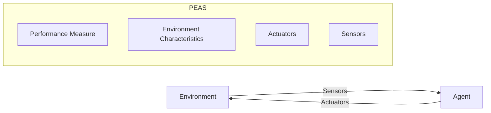

# Day 6: Agent–environment interaction and PEAS Framework

### 1) One-line definition (in your own words)

Agent–environment interaction describes how an AI agent perceives surroundings, takes actions, and receives feedback, while the PEAS framework defines task environments using Performance, Environment, Actuators, and Sensors.

### 2) Problem it solves

**Why this exists**

- Provides a structured way to design intelligent agents.
- Clarifies how agents interact with real-world environments.
- Helps specify requirements before building AI systems.

**What fails without it**

- Poor agent design due to unclear objectives.
- Missing environment constraints.
- Ineffective sensor or actuator selection.

### 3) Core idea (intuition)

**Analogy**

Consider a self-driving taxi:

- **Performance:** Safe, fast trips
- **Environment:** Roads, traffic, weather
- **Actuators:** Steering, brakes, throttle
- **Sensors:** Cameras, radar, GPS

This structure ensures systematic agent design.

**Diagram**

### 4) How it works (high-level steps)

**Step 1: Define Performance Measure**
Determine what success means (e.g., speed, safety, accuracy).

**Step 2: Describe Environment**
Identify where the agent operates (e.g., physical road, virtual grid, financial market).

**Step 3: Specify Actuators**
Define the mechanisms for interaction (e.g., motors, API calls, display).

**Step 4: Specify Sensors**
Identify how the agent perceives the environment (e.g., cameras, LIDAR, database queries).

### 5) Strengths

- Clear agent design methodology.
- Improves system reliability.
- Encourages measurable performance.
- Helps compare different AI solutions.

### 6) Weaknesses / failure cases

- Real environments can be unpredictable.
- Sensors may be noisy or incomplete.
- Performance metrics can be subjective.
- Over-simplified environment modeling.

### 7) Where it is used in real systems

**FAANG example**

- Autonomous driving research, voice assistants, recommendation systems.

**Startup example**

- Robotics automation, smart home AI, AI-powered logistics.

### 8) Keywords / terms to remember

- **Agent–environment loop**: The continuous cycle of perception and action.
- **PEAS framework**: Performance, Environment, Actuators, Sensors.
- **Performance measure**: The criteria used to evaluate an agent's success.
- **Sensors**: Inputs from the environment.
- **Actuators**: Outputs/actions to the environment.
- **Environment modeling**: Representing the world in a way the agent understands.
