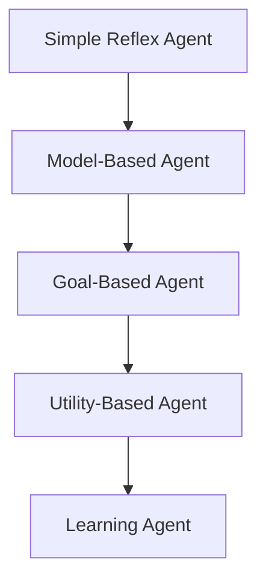

# Day 7: Types of Agents

## 1) One-line definition (in your own words)

Types of agents describe different levels of intelligence in AI systems, ranging from simple rule-based reflex agents to adaptive learning agents that improve performance over time.

## 2) Problem it solves

### Why this exists

- Not all agents behave the same way.
- AI systems need different architectures depending on environment complexity.
- Helps decide how much memory, reasoning, and learning capability an agent needs.

### What fails without it

- Overengineering simple problems by using overly complex architectures.
- Under-designing complex environments with agents that lack memory or foresight.
- Misunderstanding agent limitations and choosing the wrong tool for the task.

## 3) Core idea (intuition)

Agents evolve in sophistication based on their internal structure:

1. **Simple Reflex Agent**: Reacts only to current input (no memory).
2. **Model-Based Agent**: Keeps internal state to track things it cannot see now (memory).
3. **Goal-Based Agent**: Chooses actions that lead towards specific goals (foresight).
4. **Utility-Based Agent**: Maximizes a "happiness" or performance measure (better than just binary "goal/no-goal").
5. **Learning Agent**: Improves from experience and feedback.

### Analogy: Driving

- **Reflex**: Brake when red light appears.
- **Model-based**: Remember traffic rules or that a car is in your blind spot.
- **Goal-based**: Choose the route to get to a specific destination.
- **Utility-based**: Choose the fastest + safest route among several options.
- **Learning**: Improve driving over time after seeing how traffic patterns change.

### Hierarchy

## 4) How it works (high-level steps)

### Step 1

Define the environment's complexity, observability, and level of uncertainty.

### Step 2

Choose an appropriate agent architecture based on the required autonomy and performance.

### Step 3

Implement the specific perception sensors, decision logic (rules, goals, or utilities), and if necessary, a learning/feedback component.

## 5) Strengths

- Provides a clear architectural classification for AI design.
- Helps scale AI systems gradually as complexity increases.
- Encourages modular design (e.g., separating the learning element from the performance element).
- Supports increasing autonomy in autonomous systems.

## 6) Weaknesses / failure cases

- **Simple reflex agents** fail in partially observable environments where the current state isn't enough to make a good decision.
- **Model-based agents** require significant memory overhead to maintain the world model.
- **Utility-based systems** need precisely defined utility functions (it's hard to define "happiness").
- **Learning agents** require significant data and clear feedback (rewards) which might be hard to get in real-time.

## 7) Where it is used in real systems

### FAANG example

- Reflex-like filters in automated content moderation (simple triggers).
- Goal-based engines in route optimization (e.g., Google Maps).
- Learning agents in ad ranking and recommendation systems at scale.

### Startup example

- Chatbots (using model-based state management + learning from user feedback).
- Dynamic pricing algorithms (utility-based).
- Smart IoT control systems for energy efficiency.

## 8) Keywords / terms to remember

- **Reflex agent**: Action based on current sensation.
- **Model-based agent**: Maintains internal state.
- **Goal-based agent**: Actions driven by desired outcome.
- **Utility-based agent**: Actions driven by maximizing a preference/value.
- **Learning agent**: Component that improves performance over time.
- **Internal state**: The agent's memory of the world's status.
- **Performance measure**: The metric used to evaluate how well the agent is doing.
