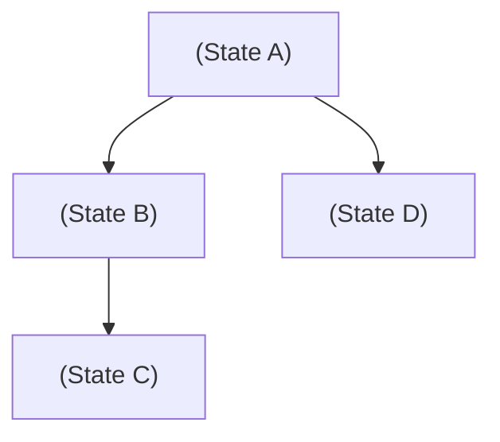

# Day 8: State Space Representation

## 1) One-line definition (in your own words)

State space representation is the formal modeling of all possible configurations (states) of a problem and the transitions between them, enabling systematic search for solutions.

## 2) Problem it solves

### Why this exists

- AI search algorithms require a structured representation of problems.
- Converts real-world tasks into mathematical models.
- Allows systematic exploration toward goal states.

### What fails without it

- No structured way to apply search algorithms.
- Inability to track progress toward goals.
- Ambiguous or inefficient solution paths.

## 3) Core idea (intuition)

### Analogy

Think of solving a maze:

- Each location = a state
- Moving up/down/left/right = transitions
- Exit = goal state

The entire maze represents the state space.

### Diagram

Each node is a state; edges represent actions.

## 4) How it works (high-level steps)

### Step 1

Define the initial state (where the agent starts).

### Step 2

Define possible actions and resulting transitions (how to move from one state to another).

### Step 3

Define goal state and termination condition (what success looks like).

## 5) Strengths

- Enables systematic problem solving.
- Works for planning, pathfinding, games.
- Clear abstraction of complex systems.
- Supports multiple search strategies.

## 6) Weaknesses / failure cases

- **State space explosion**: In large problems, the number of possible states can become unmanageable (e.g., Chess has ~10^120 states).
- Memory and computation intensive.
- Difficult to model continuous environments.
- Poor abstraction leads to inefficiency.

## 7) Where it is used in real systems

### FAANG example

- **Google Maps**: Route optimization by treating road intersections as states and roads as transitions.
- **Game AI**: AlphaZero search trees for board games.
- **Recommendations**: Sequence modeling where each user action transitions to a new preference state.

### Startup example

- **Robotics**: Navigation through physical space (converting coordinates to a grid/graph).
- **Logistics**: Delivery route planning.

## 8) Keywords / terms to remember

- **State**: A specific configuration of the system.
- **Initial state**: The starting point.
- **Goal state**: The target configuration.
- **Transition**: An action that moves from one state to another.
- **Search tree**: A graphical representation of explored paths.
- **State space explosion**: The exponential growth of states as problem complexity increases.
- **Path**: A sequence of states and transitions from initial to goal.

---

## 9) Coding Task: Grid Navigation State Space

Goal: Model a simple grid navigation problem and explore reachable states.
Implementation in: `GridStateSpace.py` and `StateSpaceExplosion.py`
