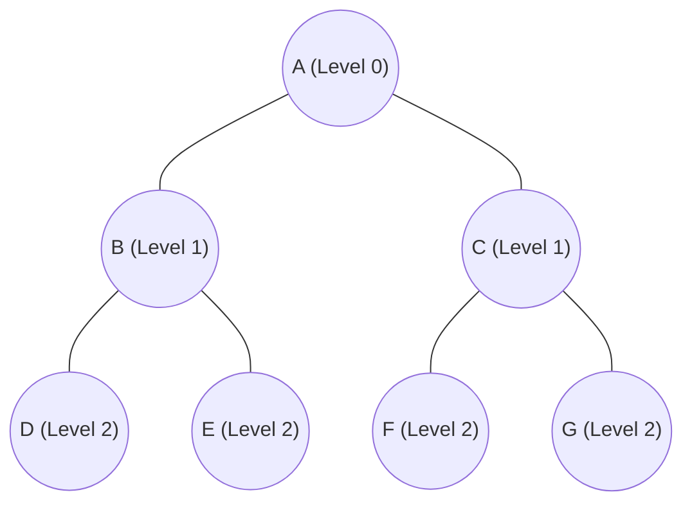

# Day 9: Breadth First Search (BFS)

## 1) One-line definition (in your own words)

Breadth First Search (BFS) is a search algorithm that explores all states at the current "distance" from the start before moving deeper, ensuring the shortest path is found in unweighted environments.

## 2) Problem it solves

### Why this exists

- Provides a systematic way to search through a state space layer by layer.
- **Guarantees the shortest path** in unweighted graphs or grids.
- Ensures complete exploration (if a path exists, BFS will find it).

### What fails without it

- Depth-first approaches might get stuck in deep or infinite branches.
- Inefficient exploration that misses the most direct solution.
- Finding suboptimal (longer) paths instead of the shortest one.

## 3) Core idea (intuition)

### Analogy

Imagine **ripples in a pond**:

- When you drop a stone, waves expand outward in perfect circles.
- BFS explores states like these ripples, touching everything at distance 1, then distance 2, and so on.

### Diagram

BFS Order: A → B, C → D, E, F, G

## 4) How it works (high-level steps)

### Step 1: Initialization

Start from the initial node and add it to a **Queue** (First-In-First-Out). Mark it as visited.

### Step 2: Exploration

Remove the node from the front of the queue and explore its neighbors.

### Step 3: Expansion

Add all unvisited neighbors to the back of the queue. Mark them as visited (and optionally store their parent to reconstruct the path later).

### Step 4: Termination

Repeat until the **Goal State** is found or the queue is empty (no path exists).

## 5) Strengths

- **Optimal**: Guarantees the shortest path in unweighted graphs.
- **Complete**: Always finds a solution if one exists in a finite state space.
- **Predictable**: Moves layer-by-layer.

## 6) Weaknesses / failure cases

- **Memory intensive**: Stores all nodes at the current frontier (can grow exponentially).
- **Time consuming**: Explores many unnecessary nodes if the goal is very deep.
- **Unweighted only**: Does not account for "costs" (use Dijkstra or A* for weighted paths).

## 7) Where it is used in real systems

### FAANG example

- **LinkedIn/Facebook**: Finding "2nd-degree" or "3rd-degree" connections (shortest path in a social graph).
- **Google Search**: Web crawling (exploring links level by level from seed URLs).

### Startup example

- **Network Routing**: Finding the fewest hops between two servers.
- **Package Managers**: Resolving dependencies (finding the direct version requirements first).

## 8) Keywords / terms to remember

- **Queue (FIFO)**: The core data structure for BFS.
- **Frontier**: The set of nodes currently waiting to be explored.
- **Shortest path**: The path with the minimum number of transitions.
- **Completeness**: The guarantee that a solution will be found.
- **Unweighted graph**: A graph where all edges have equal cost.

---

## 9) Coding Task: Shortest Path in a Grid

Goal: Implement BFS and verify that it finds the shortest path while avoiding obstacles.
Implementation in: `BFS_GridSearch.py`
